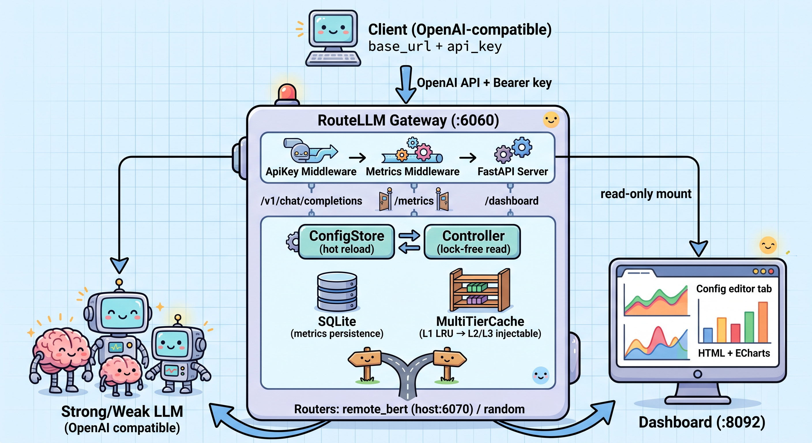

<p align="center">
  <a href="README.md">English</a> | <a href="README_zh.md">简体中文</a>
</p>

<p align="center">
  <h1 align="center">🚀 RouteLLM-Eng</h1>
  <p align="center">
    <strong>Production-Grade LLM Routing Gateway</strong><br>
    Based on LMSYS <a href="https://github.com/lmsys/routellm">RouteLLM</a> (ICLR 2025)
  </p>
  <p align="center">
    <a href="https://www.python.org/downloads/"></a>
    <a href="https://opensource.org/licenses/MIT"></a>
    <a href="#tests"></a>
    <a href="#quick-start"></a>
  </p>
</p>

---

Transforming LMSYS RouteLLM from an academic prototype into a production-grade routing gateway — adding enterprise caching, circuit breakers, full-chain observability, and async high-concurrency architecture while preserving routing effectiveness.

## ✨ Features

- ⚡ **Performance** — Refactored `LogisticRegression.fit` bottleneck (`newton-cholesky`), routing latency 394ms → 185ms. Multi-tier cache hits reduce win-rate lookup by 4 orders of magnitude.
- 🛡️ **Resilience** — Three-state circuit breaker + exponential backoff + four-level fallback chain (strong → weak → cache → 503). Never cascades.
- 📊 **Observability** — Non-invasive FastAPI middleware → SQLite → built-in ECharts dashboard. Metrics persist across restarts.
- 🔄 **Async** — Fully async router base class + `httpx.AsyncClient` connection pooling. Slow requests never block the event loop.
- ⚙️ **Hot Reload** — Model `base_url`, `api_key`, and names update at runtime. Immutable config objects with atomic replacement.
- 🔒 **Security** — API key middleware (Bearer + HMAC anti-timing-attack), `/v1/models` endpoint, strict whitelist for ops endpoints.

## 📐 Architecture

<p align="center">
  
</p>

## ⚡ Quick Start

### Docker (recommended)

```bash
cp .env.example .env       # Fill in strong/weak models and credentials
docker compose up -d       # Gateway :6060 + Dashboard :8092
```

Test with any OpenAI-compatible client:

```bash
curl http://localhost:6060/v1/chat/completions \
  -H "Authorization: Bearer $ROUTE...KEY" \
  -H "Content-Type: application/json" \
  -d '{"model":"router-bert-0.5",
       "messages":[{"role":"user","content":"Hello!"}]}'
```

> The `model` field is a **routing spec** (`router-<name>-<threshold>`), not a downstream model name.

### From source

```bash
pip install -e ".[serve,eval]"
python -m routellm.openai_server --routers random  # random needs no GPU
```

> **Drop-in replacement** — only `base_url` needs to change. Zero code modifications required.

## 📊 Evaluation

Reproduces paper metrics (APGR / CPT framework, RouteLLM, ICLR 2025):

| Dataset | APGR | 95% CI | CPT(50%) |
|---------|------|--------|----------|
| MMLU | 0.5328 | [0.5157, 0.5496] | 44.30% |
| GSM8K | 0.5294 | [0.4975, 0.5646] | 45.34% |

Random baseline APGR ≈ 0.5 — **APGR > 0.5 means routing is effective**.

> **Counter-intuitive finding**: APGR cannot select thresholds (PGR increases monotonically with strong-model usage). Use **CPT** instead — fix quality target, solve for cost.

<details>
<summary><strong>🔍 Why RouteLLM-Eng? (Upstream comparison)</strong></summary>

<br>

| Problem | Upstream | RouteLLM-Eng |
|---------|----------|-------------|
| No caching | Every request recalculates win-rate (~350ms) | Multi-tier cache, hit 0.02ms |
| No observability | `logging.info` + in-memory dict | Middleware → SQLite → ECharts |
| No fault tolerance | Bare `litellm.completion()`, no retry | Circuit breaker + retry + 4-level fallback |
| Sync blocking | Async FastAPI but sync routers | Full async: `httpx` + `asyncio.to_thread` |
| No deployment | No Dockerfile/CI | Docker (675MB) + compose dual-container |
| Config frozen | Restart to change models | Runtime hot reload, atomic swap |
| Broken defaults | Default provider removed by LiteLLM | All config via env vars, fail-fast |

</details>

## 📚 Documentation

| Path | Content |
|------|---------|
| [`docs/CHANGELOG.md`](docs/CHANGELOG.md) | Engineering log with measured data and pitfalls |
| [`docs/decisions/`](docs/decisions/) | Architecture Decision Records (ADR) |
| [`scripts/README.md`](scripts/README.md) | Script index |
| [`services/README.md`](services/README.md) | Inference service setup |

## 🧪 Tests

```bash
pytest tests/ -q
# 315 passed, 17 skipped
```

## 🔐 Open Source Hygiene

Built-in guard script checks for credentials, internal IPs, and deployment artifacts:

```bash
python scripts/check_open_source_hygiene.py        # Scan workspace
python scripts/check_open_source_hygiene.py --all  # Also scan git history
```

## 🗺️ Roadmap

- [ ] Multi-router strategy dynamic switching (BERT, Embedding, etc.)
- [ ] Prometheus / Grafana standard metrics export
- [ ] Streaming response routing optimization
- [ ] MT-Bench evaluation
- [ ] Bilingual dashboard (i18n)

## 🤝 Contributing

Before submitting a PR:

1. Run `python scripts/check_open_source_hygiene.py` — ensure no sensitive info
2. Ensure `pytest tests/ -q` passes
3. Reference [`docs/decisions/`](docs/decisions/) ADRs for architecture context

## 📄 License

MIT License (inherited from upstream). See [`LICENSE`](LICENSE).

## 📎 Citation

```bibtex
@inproceedings{ong2025routellm,
  title={RouteLLM: Learning to Route LLMs with Preference Data},
  author={Ong, Isaac and Almahairi, Amjad and Wu, Vincent and Chiang, Wei-Lin and Wu, Tianhao and Gonzalez, Joseph E. and Kadous, M Waleed and Stoica, Ion},
  booktitle={International Conference on Learning Representations (ICLR)},
  year={2025}
}
```
