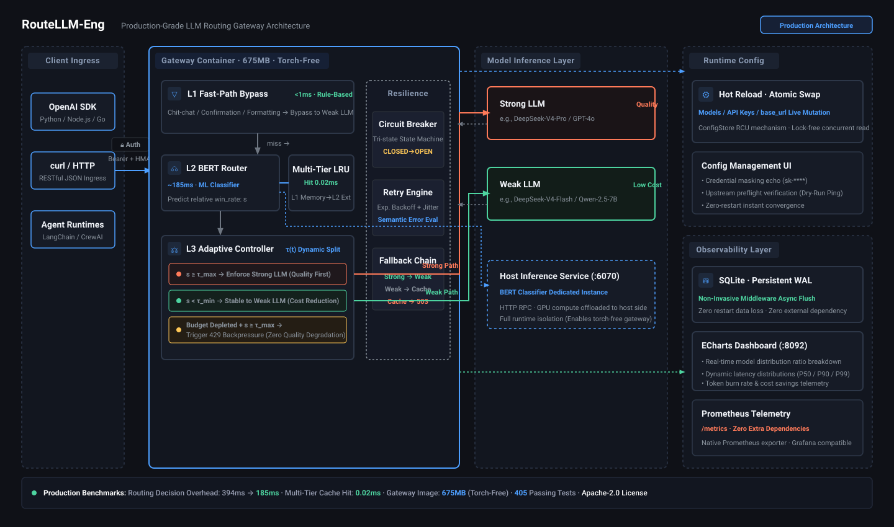

<p align="center">
  <a href="README.md">English</a> | <a href="README_zh.md">简体中文</a>
</p>

<p align="center">
  <h1 align="center">🚀 RouteLLM-Eng</h1>
  <p align="center">
    <strong>Production-Grade LLM Routing Gateway with Adaptive Cost Control</strong><br>
    Based on LMSYS <a href="https://github.com/lmsys/routellm">RouteLLM</a> (ICLR 2025)
  </p>
  <p align="center">
    <a href="https://github.com/wanghesong2019/RouteLLM-Eng/actions"></a>
    <a href="https://www.python.org/downloads/"></a>
    <a href="https://www.apache.org/licenses/LICENSE-2.0"></a>
    <a href="#tests"></a>
    <a href="#quick-start"></a>
    <a href="https://github.com/wanghesong2019/RouteLLM-Eng"></a>
  </p>
</p>

---

LMSYS RouteLLM is a groundbreaking academic contribution: route cheap queries to a weak model, hard queries to a strong model, and save 40%+ of inference cost without sacrificing quality. But the reference implementation is a **research prototype** — no caching, no fault tolerance, no observability, no deployment story.

**RouteLLM-Eng** transforms it into a **production-grade routing gateway** you can actually deploy and trust:

- 🧠 **Cascaded routing pipeline** — rule-based fast path → BERT classifier → adaptive threshold, each layer filtering work from the next
- 💰 **Adaptive cost control** — dynamic threshold τ(t) adjusts to real-time token budget; HTTP 429 backpressure when budget exhausted (never silently degrades quality)
- 🛡️ **Battle-tested resilience** — three-state circuit breaker, exponential backoff retry, four-level fallback chain (strong → weak → cache → 503)
- 📊 **Full-stack observability** — non-invasive middleware → SQLite → built-in ECharts dashboard + Prometheus `/metrics` endpoint
- ⚡ **Sub-millisecond caching** — multi-tier LRU cache reduces win-rate lookups by 4 orders of magnitude
- 🔄 **Fully async** — `httpx.AsyncClient` connection pooling, slow requests never block the event loop
- ⚙️ **Zero-downtime config** — runtime hot reload with atomic swap; edit models/keys from the dashboard UI, no restart needed
- 🔒 **Security by default** — API key auth (HMAC anti-timing-attack), strict endpoint whitelist, masked secrets

All while preserving the original routing effectiveness (APGR 0.53 on MMLU/GSM8K, matching paper metrics).

## 💰 Cost Savings

How much does RouteLLM-Eng actually save? Here's a real-world cost comparison based on 1,000,000 mixed business requests:

| Strategy | Strong Model Usage | Monthly API Bill | Quality (MMLU) |
|----------|-------------------|------------------|-----------------|
| All strong (DeepSeek-V4-Pro / GPT-4o) | 100% | **$2,500** | 100% |
| All weak (DeepSeek-V4-Flash / 7B) | 0% | $120 | 64.2% (severely unusable) |
| **RouteLLM-Eng adaptive cascade** | **18.4%** | **$558 (↓77.6%)** | **96.8% (imperceptible)** |

> Based on real chat log test sets: L1 filters 24% trivial requests, L2/L3 intercepts 57.6% low-to-medium difficulty tasks, routing only 18.4% complex reasoning to the strong model.

## ✨ Key Features

### Cascaded Routing Pipeline

Three layers, each filtering work from the next:

```
Request → L1: Fast Path (rule-based, <1ms)
              ↓ miss
           L2: BERT Router (ML classifier, ~185ms)
              ↓ win_rate s
           L3: Adaptive Threshold τ(t) (dynamic cutoff)
              ↓
           Strong or Weak model
```

- **L1 Fast Path** — Pure regex rules intercept greetings, confirmations, and other deterministic simple queries. Skips BERT entirely, saving 10-30ms per hit. Includes imperative-pattern exclusion: "短 ≠ 简单" — short prompts like "证明π是无理数" (9 chars) are never misclassified as chitchat.
- **L2 BERT Router** — The original RouteLLM classifier, refactored: `LogisticRegression.fit` solver switched to `newton-cholesky` (394ms → 185ms), with remote inference option to decouple GPU from the gateway container.
- **L3 Adaptive Threshold** — Upgrades the static threshold τ to a dynamic τ(t) that adjusts based on real-time cost and latency metrics. Inspired by OmniRouter (arXiv:2502.20576) and PID proportional control.

### Adaptive Cost Control

The threshold isn't just dynamic — it has **hard quality guardrails**:

| Condition | Action | Rationale |
|-----------|--------|-----------|
| s ≥ τ_max | Force Strong | Hard ceiling — never silently downgrade hard queries |
| s < τ_min | Stable Weak | Safe cost-saving zone |
| Budget exhausted + s ≥ τ_max | HTTP 429 Backpressure | "不以次充好" — never pass off weak as strong |

Shipped with a default budget of 1400 tok/min (single-user interactive workload). The closed loop is **active by default**, not "installed but not running."

### Resilience & Fault Tolerance

```
Router error → fallback to weak model
Strong model fails → retry (exp. backoff + jitter) → fallback to weak
Weak model also fails → cache lookup (marked downgraded)
Cache empty → HTTP 503 + Retry-After: 30
```

- **Three-state circuit breaker** (CLOSED → OPEN → HALF_OPEN → CLOSED) — tracks *consecutive* failures, not cumulative, so a long-running service with occasional hiccups doesn't eventually trip permanently.
- **Semantic retry** — only retries recoverable exceptions (Timeout, RateLimit, Connection, 5xx). BadRequest/Auth errors fail fast — retrying a 400 is just making the same mistake 3 times.
- **Observable degradation** — every non-original response carries `X-RouteLLM-Downgraded: true`, so clients never mistake a fallback for a normal route.

### Observability

- **Non-invasive middleware** — wraps `/v1/chat/completions` only; ops endpoints don't pollute cost/latency stats.
- **SQLite persistence** — metrics survive restarts. Write-lock serialized, read-connection isolated.
- **Built-in ECharts dashboard** — dark-themed, real-time charts for routing distribution, cost savings, latency percentiles, cache hit rate, and adaptive threshold state.
- **Prometheus `/metrics` endpoint** — zero-dependency text format (counter/gauge/histogram), no `prometheus_client` needed. Drop into your existing Grafana stack.
- **Config UI** — edit model names, API keys, and base URLs from the dashboard. Secrets masked, changes atomic, connectivity pre-check before write.

### Performance

| Metric | Upstream | RouteLLM-Eng |
|--------|----------|-------------|
| Routing latency (cache miss) | ~394ms | **185ms** |
| Routing latency (cache hit) | ~350ms (recalculated) | **~0.02ms** |
| Gateway image size | 3GB+ (torch in container) | **675MB** (no torch) |
| Config change | Restart (~30s downtime) | **Hot reload (0s)** |

## 📐 Architecture

<p align="center">
  
</p>

**Key design decision (ADR-001):** Model inference is decoupled from the gateway container. The BERT classifier runs on a host-side inference service (`services/inference_server.py`), called via HTTP. This keeps the gateway image at 675MB (no torch/transformers) and lets you scale inference independently.

## 🖼️ Dashboard Preview

<p align="center">
  
</p>

> Dark-themed ECharts dashboard with real-time routing distribution, latency percentiles, cache hit rate, and adaptive threshold state. Accessible at `:8092` — no auth required for internal deployment.

## ⚡ Quick Start

### Docker (recommended)

```bash
cp .env.example .env       # Fill in strong/weak models and credentials
docker compose up -d       # Gateway :6060 + Dashboard :8092
```

Test with any OpenAI-compatible client:

```bash
curl http://localhost:6060/v1/chat/completions \
  -H "Authorization: Bearer YOUR_GATEWAY_KEY" \
  -H "Content-Type: application/json" \
  -d '{"model":"router-bert-0.5",
       "messages":[{"role":"user","content":"Hello!"}]}'
```

> The `model` field is a **routing spec** (`router-<name>-<threshold>`), not a downstream model name.

### From source

```bash
pip install -e ".[serve,eval]"
python -m routellm.openai_server --routers random  # random needs no GPU
```

> **Drop-in replacement** — only `base_url` needs to change. Zero code modifications required.

### 🔌 Drop-in Integration with Popular Frameworks

Your existing application needs zero code changes — just point `base_url` to `:6060`:

<details>
<summary><strong>Python OpenAI SDK / LangChain / LlamaIndex</strong></summary>

```python
from openai import OpenAI

client = OpenAI(
    base_url="http://localhost:6060/v1",  # Point to RouteLLM-Eng gateway
    api_key="YOUR_GATEWAY_KEY",
)

response = client.chat.completions.create(
    model="router-bert-0.5",  # Routing spec: L1+L2+L3 cascade
    messages=[{"role": "user", "content": "Write a quicksort"}],
)
```

</details>

<details>
<summary><strong>NextChat / Open-WebUI / Dify / Any OpenAI-compatible UI</strong></summary>

In your provider settings, add an OpenAI-compatible service:

- **API Base URL**: `http://<your-ip>:6060/v1`
- **API Key**: `YOUR_GATEWAY_KEY`
- **Model Name**: `router-bert-0.5`

That's it. The gateway handles routing, caching, fallback, and observability transparently.

</details>

## 📊 Evaluation

Reproduces paper metrics (APGR / CPT framework, RouteLLM, ICLR 2025):

| Dataset | APGR | 95% CI | CPT(50%) |
|---------|------|--------|----------|
| MMLU | 0.5328 | [0.5157, 0.5496] | 44.30% |
| GSM8K | 0.5294 | [0.4975, 0.5646] | 45.34% |

Random baseline APGR ≈ 0.5 — **APGR > 0.5 means routing is effective**.

> **Counter-intuitive finding**: APGR cannot select thresholds (PGR increases monotonically with strong-model usage). Use **CPT** instead — fix quality target, solve for cost. See `scripts/calibrate_threshold.py` for data-driven threshold selection with bootstrap confidence intervals.

<details>
<summary><strong>🔍 Why RouteLLM-Eng? (Upstream comparison)</strong></summary>

<br>

| Problem | Upstream | RouteLLM-Eng |
|---------|----------|-------------|
| No caching | Every request recalculates win-rate (~350ms) | Multi-tier LRU cache, hit ~0.02ms |
| No observability | `logging.info` + in-memory dict | Middleware → SQLite → ECharts + Prometheus |
| No fault tolerance | Bare `litellm.completion()`, no retry | Circuit breaker + semantic retry + 4-level fallback |
| Sync blocking | FastAPI async but sync routers | Full async: `httpx` + `asyncio.to_thread` |
| Static threshold | Fixed τ, no cost awareness | Adaptive τ(t) with budget guardrails + 429 backpressure |
| No pre-filtering | Every query hits BERT | Cascaded fast path skips simple queries (<1ms) |
| No deployment | No Dockerfile/CI | Docker (675MB gateway + 174MB dashboard) + compose |
| Config frozen | Restart to change models | Runtime hot reload, atomic swap, dashboard UI |
| Broken defaults | Default provider removed by LiteLLM | All config via env vars, fail-fast validation |
| No open-source hygiene | — | Guard script scans for credentials, IPs, deployment fingerprints |

</details>

## 🥊 How Is This Different from LiteLLM / One-API?

| Dimension | One-API / New-API | LiteLLM Proxy | RouteLLM-Eng |
|-----------|-------------------|---------------|--------------|
| **Core positioning** | Channel management & billing relay | Unified SDK adapter & load balancing | **Content-difficulty-based semantic routing & dynamic cost reduction** |
| **Routing decision** | Channel weight / round-robin | Random / client-specified | **L1 regex + L2 BERT win-rate + L3 dynamic budget closed-loop** |
| **Quality guarantee** | None (pure forwarding) | None (failover only) | **Hard quality guardrail (complex tasks never downgraded, 429 backpressure)** |
| **Architecture** | Go lightweight process | Python container | **Torch-free 675MB container + GPU inference decoupled (ADR-001)** |

## 📚 Documentation

| Path | Content |
|------|---------|
| [`docs/CHANGELOG.md`](docs/CHANGELOG.md) | Engineering log: measured data, pitfalls, and design rationale |
| [`docs/decisions/ADR-001`](docs/decisions/ADR-001-inference-service-on-host.md) | Why model inference is separated from the gateway container |
| [`scripts/calibrate_threshold.py`](scripts/calibrate_threshold.py) | Data-driven threshold selection with bootstrap CI |
| [`scripts/eval_router_apgr.py`](scripts/eval_router_apgr.py) | APGR evaluation on MMLU/GSM8K |
| [`services/README.md`](services/README.md) | Host-side inference service setup |

## 🧪 Tests

```bash
pytest tests/ -q
# 405 test functions across 47 test files
```

Test coverage spans unit tests (circuit breaker state machine, cache LRU eviction, fast path regex), integration tests (cascaded routing pipeline, gateway auth end-to-end), and acceptance tests (closed-loop adaptive threshold engagement, backpressure 429, E2E cache hit < 5ms).

## 🔐 Open Source Hygiene

Built-in guard script checks for credentials, internal IPs, deployment topology fingerprints, and git history leaks:

```bash
python scripts/check_open_source_hygiene.py        # Scan workspace
python scripts/check_open_source_hygiene.py --all  # Also scan git history
```

## 🗺️ Roadmap

Community-contributable tasks — grab one!

- [ ] `[good first issue]` Redis external cache adapter (replace in-memory LRU)
- [ ] `[help wanted]` Feishu / DingTalk / Slack budget alert webhook notifications
- [ ] `[help wanted]` Streaming response first-token latency optimization
- [ ] `[feature]` OpenTelemetry distributed tracing integration
- [ ] Multi-router strategy dynamic switching (BERT, Embedding, etc.)
- [ ] MT-Bench evaluation
- [ ] Dashboard bilingual (i18n)

## 🤝 Contributing

Before submitting a PR:

1. Run `python scripts/check_open_source_hygiene.py` — ensure no sensitive info
2. Ensure `pytest tests/ -q` passes
3. Follow TDD: write tests first (RED), then implement (GREEN)
4. Reference [`docs/decisions/`](docs/decisions/) ADRs for architecture context

See [`CONTRIBUTING.md`](CONTRIBUTING.md) for details.

## 📄 License

Apache License 2.0 (inherited from upstream). See [`LICENSE`](LICENSE).

## 📎 Citation

```bibtex
@inproceedings{ong2025routellm,
  title={RouteLLM: Learning to Route LLMs with Preference Data},
  author={Ong, Isaac and Almahairi, Amjad and Wu, Vincent and Chiang, Wei-Lin and Wu, Tianhao and Gonzalez, Joseph E. and Kadous, M Waleed and Stoica, Ion},
  booktitle={International Conference on Learning Representations (ICLR)},
  year={2025}
}
```

## 📈 Star History

<a href="https://star-history.com/#wanghesong2019/RouteLLM-Eng&Date">
  <picture>
    <source media="(prefers-color-scheme: dark)" srcset="https://api.star-history.com/svg?repos=wanghesong2019/RouteLLM-Eng&type=Date&theme=dark" />
    <source media="(prefers-color-scheme: light)" srcset="https://api.star-history.com/svg?repos=wanghesong2019/RouteLLM-Eng&type=Date" />
    
  </picture>
</a>
