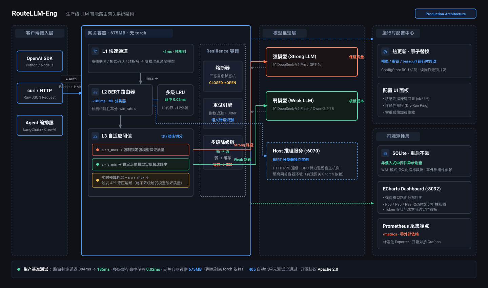
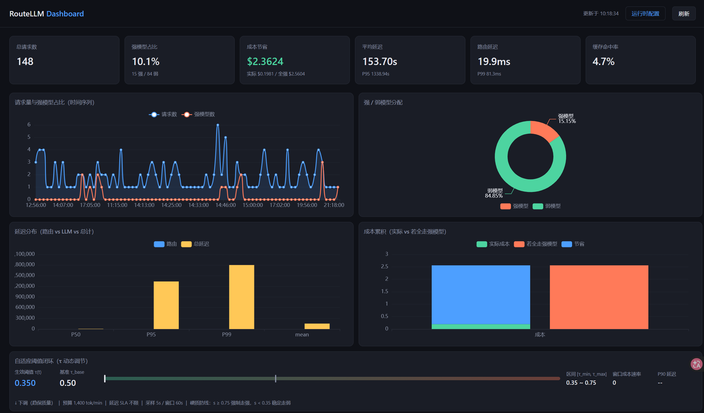

<p align="center">
  <a href="README.md">English</a> | <a href="README_zh.md">简体中文</a>
</p>

<p align="center">
  <h1 align="center">🚀 RouteLLM-Eng</h1>
  <p align="center">
    <strong>生产级 LLM 路由网关 · 自适应成本控制</strong><br>
    基于 LMSYS <a href="https://github.com/lmsys/routellm">RouteLLM</a>（ICLR 2025）
  </p>
  <p align="center">
    <a href="https://github.com/wanghesong2019/RouteLLM-Eng/actions"></a>
    <a href="https://www.python.org/downloads/"></a>
    <a href="https://www.apache.org/licenses/LICENSE-2.0"></a>
    <a href="#测试"></a>
    <a href="#快速开始"></a>
    <a href="https://github.com/wanghesong2019/RouteLLM-Eng"></a>
  </p>
</p>

---

LMSYS RouteLLM 是一项开创性的学术贡献：把简单问题路由到弱模型、困难问题路由到强模型，在不牺牲质量的前提下节省 40%+ 推理成本。但参考实现是一个**研究原型**——没有缓存、没有容错、没有可观测性、没有部署方案。

**RouteLLM-Eng** 把它改造成你可以真正部署和信赖的**生产级路由网关**：

- 🧠 **级联路由管线** — 规则快速通道 → BERT 分类器 → 自适应阈值，每层为下一层过滤工作量
- 💰 **自适应成本控制** — 动态阈值 τ(t) 随实时 Token 预算调节；预算耗尽时 HTTP 429 背压（绝不静默降级质量）
- 🛡️ **经过实战检验的容错** — 三态熔断器、指数退避重试、四级降级链（强 → 弱 → 缓存 → 503）
- 📊 **全链路可观测性** — 非侵入式中间件 → SQLite → 内置 ECharts 面板 + Prometheus `/metrics` 端点
- ⚡ **亚毫秒级缓存** — 多级 LRU 缓存将 win-rate 查询降低 4 个数量级
- 🔄 **全异步架构** — `httpx.AsyncClient` 连接池复用，慢请求不再阻塞事件循环
- ⚙️ **零停机配置** — 运行时热更新，原子替换；从面板 UI 编辑模型/密钥，无需重启
- 🔒 **默认安全** — API key 鉴权（HMAC 防时序侧信道）、端点严格白名单、密钥掩码回显

以上全部改造均在保持原始路由有效性的前提下完成（MMLU/GSM8K 上 APGR 0.53，与论文指标一致）。

## 💰 真实省钱测算

RouteLLM-Eng 到底能省多少钱？以下是基于 1,000,000 次混合业务请求的真实开销对比：

| 调度方案 | 强模型调用比例 | 月度 API 账单 | 质量留存率（MMLU） |
|----------|--------------|-------------|-------------------|
| 全量调用强模型（DeepSeek-V4-Pro / GPT-4o） | 100% | **$2,500** | 100% |
| 全量调用弱模型（DeepSeek-V4-Flash / 7B） | 0% | $120 | 64.2%（严重不可用） |
| **RouteLLM-Eng 自适应级联网关** | **18.4%** | **$558（直降 77.6%）** | **96.8%（质量无感衰减）** |

> 基于真实聊天日志测试集测算：L1 过滤 24% 琐碎请求，L2/L3 拦截 57.6% 中低难度任务，仅将 18.4% 复杂推理分派至强模型。

## ✨ 核心特性

### 级联路由管线

三层过滤，每层为下一层减少工作量：

```
请求 → L1: 快速通道（规则匹配，<1ms）
              ↓ 未命中
           L2: BERT 路由器（ML 分类器，~185ms）
              ↓ win_rate s
           L3: 自适应阈值 τ(t)（动态切分点）
              ↓
           强模型 或 弱模型
```

- **L1 快速通道** — 纯正则规则拦截寒暄、确认等确定性简单 Query，直接跳过 BERT，每次命中节省 10-30ms。内含指令性模式排除：「短 ≠ 简单」——"证明π是无理数"（9 个字）这类短文本永远不会被误判为寒暄。
- **L2 BERT 路由器** — 原版 RouteLLM 分类器，重构：`LogisticRegression.fit` 求解器改为 `newton-cholesky`（394ms → 185ms），支持远程推理将 GPU 与网关容器解耦。
- **L3 自适应阈值** — 将静态阈值 τ 升级为动态 τ(t)，根据实时成本与延迟指标平滑调节。设计依据来自 OmniRouter（arXiv:2502.20576）约束优化思路 + PID 比例控制。

### 自适应成本控制

阈值不只是动态的——它有**硬质量防线**：

| 条件 | 动作 | 理由 |
|------|------|------|
| s ≥ τ_max | 强制走强模型 | 硬上限——绝不静默降级困难请求 |
| s < τ_min | 稳定走弱模型 | 安全降本区 |
| 预算耗尽 + s ≥ τ_max | HTTP 429 背压 | 「不以次充好」——绝不把弱模型冒充强模型 |

出厂默认预算 1400 tok/min（单人交互对话口径）。闭环**默认即生效**，不是「装好了但没发动」。

### 容错与降级

```
路由器异常 → 降级到弱模型
强模型失败 → 重试（指数退避 + 抖动）→ 降级到弱模型
弱模型也失败 → 查缓存返回历史响应（标记 downgraded）
缓存也无 → HTTP 503 + Retry-After: 30
```

- **三态熔断器**（CLOSED → OPEN → HALF_OPEN → CLOSED）—— 记录*连续*失败而非累计失败，长期运行偶发抖动不会最终必然开路。
- **语义重试** — 只重试可恢复异常（Timeout、RateLimit、Connection、5xx）。BadRequest/Auth 类错误立即失败——重试 400 只是犯 3 遍同样的错。
- **可观测降级** — 每个非原始路由结果的响应都带 `X-RouteLLM-Downgraded: true`，客户端不会把降级结果误认为正常路由。

### 可观测性

- **非侵入式中间件** — 只拦截 `/v1/chat/completions`；运维端点不污染成本/延迟统计。
- **SQLite 持久化** — 指标重启不丢失。写锁串行化，读连接独立。
- **内置 ECharts 面板** — 暗色主题，实时展示路由分布、成本节省、延迟分位、缓存命中率、自适应阈值状态。
- **Prometheus `/metrics` 端点** — 零依赖文本格式（counter/gauge/histogram），无需 `prometheus_client`。直接接入现有 Grafana 监控体系。
- **配置 UI** — 从面板编辑模型名、API key、base_url。密钥掩码、变更原子生效、写入前连通性预检。

### 性能

| 指标 | 上游 | RouteLLM-Eng |
|------|------|-------------|
| 路由延迟（缓存未命中） | ~394ms | **185ms** |
| 路由延迟（缓存命中） | ~350ms（重算） | **~0.02ms** |
| 网关镜像大小 | 3GB+（容器内含 torch） | **675MB**（不含 torch） |
| 配置变更 | 重启（~30s 中断） | **热更新（0s）** |

## 📐 架构

<p align="center">
  
</p>

**关键设计决策（ADR-001）：** 模型推理与网关容器解耦。BERT 分类器运行在宿主机侧推理服务（`services/inference_server.py`），通过 HTTP 调用。这使得网关镜像仅 675MB（不含 torch/transformers），且推理可独立扩缩容。

## 🖼️ 面板预览

<p align="center">
  
</p>

> 暗色主题 ECharts 面板，实时展示路由分布、延迟分位、缓存命中率与自适应阈值状态。访问 `:8092`——内网部署免鉴权。

## ⚡ 快速开始

### Docker（推荐）

```bash
cp .env.example .env       # 填入强弱模型与凭据
docker compose up -d       # 网关 :6060 + 面板 :8092
```

任何 OpenAI 兼容客户端均可接入：

```bash
curl http://localhost:6060/v1/chat/completions \
  -H "Authorization: Bearer YOUR_G...EY" \
  -H "Content-Type: application/json" \
  -d '{"model":"router-bert-0.5",
       "messages":[{"role":"user","content":"你好！"}]}'
```

> `model` 字段是**路由规格**（`router-<name>-<threshold>`），不是下游模型名。

### 从源码运行

```bash
pip install -e ".[serve,eval]"
python -m routellm.openai_server --routers random  # random 不需要 GPU
```

> **无缝替换** — 只需改 `base_url`，零代码改动。

## 📊 评测

复现论文指标（APGR / CPT 框架，RouteLLM, ICLR 2025）：

| 数据集 | APGR | 95% CI | CPT(50%) |
|---------|------|--------|----------|
| MMLU | 0.5328 | [0.5157, 0.5496] | 44.30% |
| GSM8K | 0.5294 | [0.4975, 0.5646] | 45.34% |

随机基线 APGR ≈ 0.5 —— **APGR > 0.5 才算路由有效**。

> **反直觉发现**：APGR 不能用来选阈值（PGR 随走强比例单调递增）。应改用 **CPT** —— 先定质量目标，再反解成本。见 `scripts/calibrate_threshold.py`，支持 bootstrap 置信区间的数据驱动阈值标定。

<details>
<summary><strong>🔍 为什么选择 RouteLLM-Eng？（与上游对比）</strong></summary>

<br>

| 问题 | 上游 | RouteLLM-Eng |
|------|------|-------------|
| 无缓存 | 每次请求重算 win-rate（~350ms） | 多级 LRU 缓存，命中 ~0.02ms |
| 无可观测性 | `logging.info` + 内存 dict | 中间件 → SQLite → ECharts + Prometheus |
| 无容错 | 裸调 `litellm.completion()`，无重试 | 熔断器 + 语义重试 + 四级降级链 |
| 同步阻塞 | FastAPI 异步但路由器同步 | 全面异步：`httpx` + `asyncio.to_thread` |
| 静态阈值 | 固定 τ，无成本感知 | 自适应 τ(t) + 预算防线 + 429 背压 |
| 无前置过滤 | 每个 Query 都走 BERT | 级联快速通道跳过简单请求（<1ms） |
| 无部署 | 无 Dockerfile/CI | Docker（675MB 网关 + 174MB 面板）+ compose |
| 配置固化 | 改模型需重启 | 运行时热更新，原子替换，面板 UI |
| 默认即坏 | 默认 provider 已被 LiteLLM 移除 | 全部配置走环境变量，fail-fast 校验 |
| 无开源卫生 | — | 守卫脚本扫描凭据、内网 IP、部署拓扑指纹 |

</details>

## 📚 文档

| 路径 | 内容 |
|------|------|
| [`docs/CHANGELOG.md`](docs/CHANGELOG.md) | 工程日志：实测数据、踩坑记录、设计依据 |
| [`docs/decisions/ADR-001`](docs/decisions/ADR-001-inference-service-on-host.md) | 为什么模型推理与网关容器解耦 |
| [`scripts/calibrate_threshold.py`](scripts/calibrate_threshold.py) | 数据驱动阈值标定（bootstrap CI） |
| [`scripts/eval_router_apgr.py`](scripts/eval_router_apgr.py) | MMLU/GSM8K 上的 APGR 评测 |
| [`services/README.md`](services/README.md) | 宿主机侧推理服务部署 |

## 🧪 测试

```bash
pytest tests/ -q
# 405 个测试函数，覆盖 47 个测试文件
```

测试覆盖范围：单元测试（熔断器状态机、缓存 LRU 淘汰、快速通道正则）、集成测试（级联路由管线、网关鉴权端到端）、验收测试（闭环自适应阈值介入、背压 429、E2E 缓存命中 < 5ms）。

## 🔐 开源卫生

内置守卫脚本检查凭据、内网 IP、部署拓扑指纹与 git 历史泄漏：

```bash
python scripts/check_open_source_hygiene.py        # 扫描工作区
python scripts/check_open_source_hygiene.py --all  # 同时扫描 git 历史
```

## 🗺️ 路线图

- [ ] 多路由器策略动态切换（BERT、Embedding 等）
- [ ] 流式响应路由优化
- [ ] MT-Bench 评测
- [ ] 面板双语化（i18n）
- [ ] 分布式追踪（OpenTelemetry）

## 🤝 贡献指南

提交 PR 前请：

1. 运行 `python scripts/check_open_source_hygiene.py` —— 确保无敏感信息
2. 确保 `pytest tests/ -q` 通过
3. 遵循 TDD：先写测试确认失败（RED），再改代码（GREEN）
4. 参考 [`docs/decisions/`](docs/decisions/) 下的 ADR 了解架构背景

详见 [`CONTRIBUTING.md`](CONTRIBUTING.md)。

## 📄 许可证

Apache License 2.0（继承自上游）。见 [`LICENSE`](LICENSE)。

## 📎 引用

```bibtex
@inproceedings{ong2025routellm,
  title={RouteLLM: Learning to Route LLMs with Preference Data},
  author={Ong, Isaac and Almahairi, Amjad and Wu, Vincent and Chiang, Wei-Lin and Wu, Tianhao and Gonzalez, Joseph E. and Kadous, M Waleed and Stoica, Ion},
  booktitle={International Conference on Learning Representations (ICLR)},
  year={2025}
}
```
